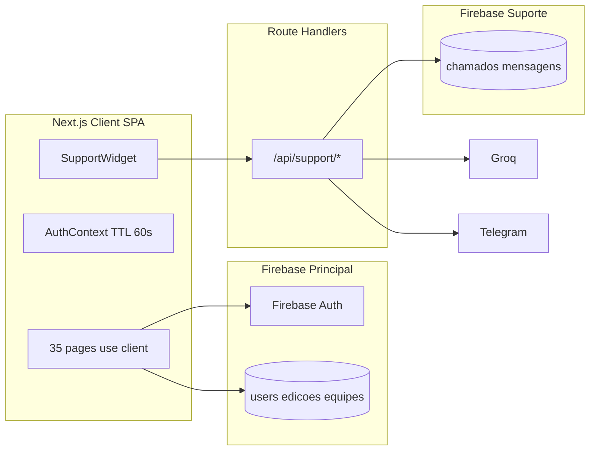
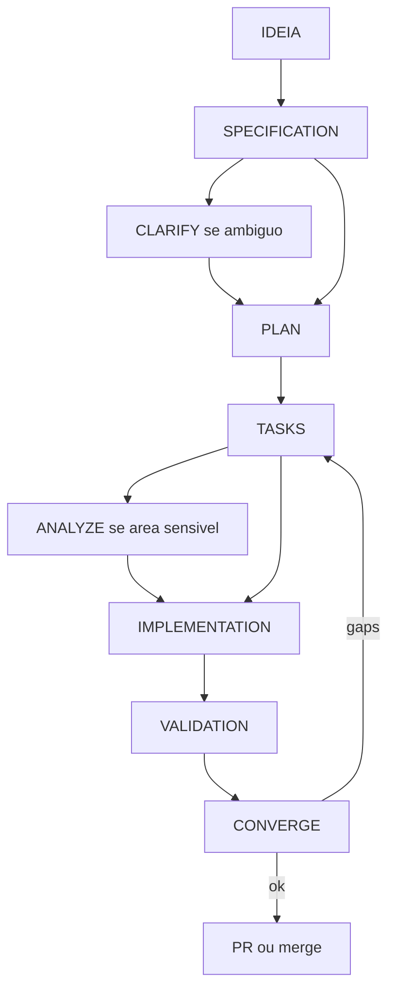

# DHPB 2026 — Plano de Adoção de Spec-Driven Development (SDD)

Este plano é específico do DHPB 2026 (Next.js 16 App Router, Firebase Spark, duas instâncias Firestore). Não descreve SDD genérico.

Referência oficial: [GitHub Spec Kit](https://github.github.io/spec-kit/) — fluxo Spec → Plan → Tasks → Implement → Converge; em features de produção: constitution, specify, clarify, plan, checklist, tasks, analyze, implement, converge.

O conhecimento do sistema **já existente** permanece em `/docs`. A infraestrutura SDD (`specs/`, `.cursor/rules/`) está no repositório. `.specify/` e `specify-cli` são opcionais e **não** foram instalados (sem dependência extra).

---

## 1. Estado atual

O DHPB é uma plataforma de olimpíada acadêmica (IFPB) já em código, operando como **SPA client-side** no App Router.

- **Stack confirmada:** Next.js `16.2.6`, React `19.2.4`, Firebase Web SDK `^12.13.0`, Tailwind v4, `jose`, TipTap, `firebase-admin` (tokens do suporte). Groq/Telegram via `fetch` nas Route Handlers — **não** há pacote OneSignal no `package.json`.
- **Rotas:** 35 `page.jsx` (todas com `'use client'`) + 6 APIs em `src/app/api/support/`. O build reporta 43 páginas estáticas (alinha com `docs/PROJECT_CONTEXT.md`).
- **Dois Firebase:** principal em `src/lib/firebase.js` (persistência + `experimentalForceLongPolling: true`); suporte em `src/lib/support/firebase.js` (app nomeado `'support'`, **sem** long polling).
- **Backend Next.js:** exclusivo do suporte (`auth`, `ai`, `notify-telegram`, `webhook-telegram`, `cron-auto-close`, `cleanup-telegram`) + `src/lib/support/server/firestore-rest.js`.
- **SDD:** infraestrutura na Onda 1 (`specs/_templates/`, `.cursor/rules/dhpb-sdd.mdc`, `.cursor/rules/dhpb-constitution.mdc`). Sem `specify-cli` / `.specify/`. Sem specs de feature ainda.
- **README** na raiz ainda é boilerplate do create-next-app.



---

## 2. Documentação existente

Função de cada arquivo em `docs/` — **conhecimento do sistema legado**, não specs de feature:

| Documento | Função para SDD |
|---|---|
| `docs/PROJECT_CONTEXT.md` | Entrada obrigatória do agente: stack, matriz de leitura, arquivos críticos, regras de custo |
| `docs/CONSTITUTION.md` | Princípios inegociáveis (equivalente funcional ao `constitution` do Spec Kit) |
| `docs/ARCHITECTURE.md` | Fluxos estudante/professor, decisões (REST vs Admin SDK, subcoleções, escolas JSON) |
| `docs/DATABASE.md` | Schema pretendido das duas instâncias Firestore |
| `docs/AUTHENTICATION.md` | Papéis, rotas, auth cruzada do suporte |
| `docs/BUSINESS_RULES.md` | Regras confirmadas / inferidas / pendentes de confirmação humana |
| `docs/INTEGRATIONS.md` | Firebase, Cloudinary, Groq, Telegram, OneSignal, env vars |
| `docs/CODE_CONVENTIONS.md` | Naming, `'use client'`, Suspense, paleta, queries |
| `docs/KNOWN_ISSUES.md` | Limitações conscientes (admin suporte, índices, órfãos Cloudinary, Spark) |
| `docs/SDD_ADOPTION_PLAN.md` | Este plano: como aplicar SDD daqui para frente sem reconstruir o projeto |

A matriz em `PROJECT_CONTEXT.md` §3.2 é o mecanismo de **economia de contexto** já existente e deve ser a porta de entrada de todo plano/spec.

---

## 3. Lacunas

### 3.1 Docs vs código (corrigir depois, sem implementar features)

Não tratar `/docs` como verdade absoluta. Inconsistências encontradas na auditoria:

- **OneSignal:** documentado em INTEGRATIONS, BUSINESS_RULES e KNOWN_ISSUES (`OneSignal.jsx`, bypass localhost). **Não existe em `src/`** nem em `package.json`.
- **Escola/modalidade iguais:** regra documentada; no código só há campos no doc da equipe. `src/app/montagem-equipe/page.jsx` **não** valida escola/modalidade do aluno ao adicionar.
- **Questionário individual obrigatório para entrar:** vale em criar-equipe e no clique da edição; **não** vale no convite por e-mail.
- **`aprovadoAte`:** só `src/app/sala-de-equipe/page.jsx` aplica. `/resumo-fase` e `/questao` checam status da fase, não a liberação da equipe.
- **Schema suporte:** mensagens usam `autorTipo`/`conteudo`/`enviadoEm`, não `autor`/`texto`/`timestamp`. CSAT é `avaliacao` + coleção `avaliacoes_suporte`, não `avaliacaoCSAT`. `respostas_rapidas.resposta`, não `texto`.
- **`membro-index`:** ID `btoa(email).replace(/=+$/,'') + '_' + edicaoId`; payload real `{ equipeId, papel, uid }` — sem `email`/`edicaoId`. Normalização de e-mail **inconsistente** (criar-equipe lowercased; montagem/home muitas vezes não).
- **Coleções omitidas:** `escolas`, `fcm_tokens`, `avaliacoes_suporte`, `atendentes_telegram`; campos `equipes.isCompleta`, `equipes.premiacao`; mapas embutidos `equipes.respostas` e `equipes.pontuacoes` (ranking lê o mapa, não a subcoleção).
- **`edicoes.status`:** documentado, nunca lido/escrito (status vive em `fases`).
- **Admin suporte:** `SUPPORT_ADMIN_EMAILS` no backend; `src/lib/support/adminAuth.js` **não é usado**; páginas `/admin/suporte` sem guard (alinhado a KNOWN_ISSUES, não a AUTHENTICATION).
- **Admin principal:** `signInWithEmailAndPassword(auth, 'admin@dhpb.com', senha)` + `localStorage('admin-authenticated')` — mais frágil do que o doc sugere.
- **Cloudinary:** provas usam `optimizeCloudinaryUrl`; admin de questões/documentos serve URL crua em preview.
- **Full scans:** dashboard admin faz `getDocsFromServer(equipes)` várias vezes (migrações conscientes). A constitution diz “nunca”; a prática admin viola isso de propósito.
- **Rotas fora da matriz:** `/admin/firestore`, `/admin/questionarios`, `/cadastro-escola`, `/certificado`, `/provas-antigas/*`, `/biblioteca`, etc.
- **SupportWidget:** oculto também em `/certificado` e `/certificado-medalha` (doc só cita `/admin/*`).

### 3.2 Ainda não documentado (necessário para SDD)

- Regras de segurança Firestore (client SDK escreve direto — as “regras de negócio” no cliente **não** são enforcement de servidor).
- Critérios de desempate e de medalha (já marcados como pendentes; código: ordenação por `df`; medalha **manual** via `premiacao`).
- Fase final presencial (mencionada, sem fluxo).
- Inventário de índices compostos (principal + suporte).
- Contrato do JSON da IA (`src/lib/support/ai/knowledge.js`) e estados de chamado.
- Testes: não há suíte; validação hoje = `npm run build` + checagem manual.
- Calendarização da 1ª fase (set/2026) como restrição de janela de risco.

---

## 4. Constitution

`docs/CONSTITUTION.md` já é o constitution do projeto. No Spec Kit isso vive em `.specify/memory/constitution.md`. **Fonte da verdade permanece `docs/CONSTITUTION.md`.**

Papel para agentes:

1. Toda spec/plan/task deve **citar** quais princípios se aplicam (Free Tier, Cloudinary, isolamento Firebase, atomicidade, `'use client'` + Suspense, segredos só em `src/app/api/*`).
2. Nenhum plano pode propor `getDocs(collection)` sem `where`/`limit` no caminho de aluno/prova; scans admin devem ser explícitos e justificados.
3. Checklist de finalização da constitution (§2) vira gate de implement e converge.
4. Um passo **opcional** (Onda 1) é `specify init .` e copiar/apontar a constitution — sem reescrever princípios.

Princípios extras a incorporar na constitution (descobertos no código, ainda não escritos):

- Dual-write consciente: subcoleção **e** mapa embutido em equipe (`src/app/questao/page.jsx`) até haver spec de remoção do legado.
- `membro-index` é a trava de unicidade; qualquer mudança em membros deve manter batch/transação.
- Não editar `public/escolas-pb.json` manualmente.

---

## 5. Specifications

Specs **só para trabalho novo ou mudança de comportamento**, nunca para “reespecificar o sistema inteiro”.

Cada feature em `specs/<nnn-slug>/spec.md` deve conter, neste projeto:

- **Problema / valor** (ex.: emissão de certificado, correção de gate `aprovadoAte`).
- **Atores:** estudante, professor (`documentoStatus`), admin principal, atendente (`SUPPORT_ADMIN_EMAILS`).
- **Escopo negativo:** o que não mexer (lista da §9).
- **Regras de negócio afetadas** com status *as-is no código* vs *to-be* (evitar copiar docs desatualizados).
- **Leituras Firestore previstas** (coleção, `where`/`limit`, listeners) — obrigatório por causa do Spark.
- **Writes:** `writeBatch` vs `runTransaction` vs `increment`; impacto em `df` / `membro-index` / `aprovadoAte`.
- **Qual Firebase** (principal vs suporte) — nunca os dois sem justificativa.
- **Critérios de aceite testáveis** (comportamento + cota + build).
- **Docs a atualizar** em `/docs` se schema ou rota mudar.

Usar `/speckit.specify` + `/speckit.clarify` (ou o equivalente no Cursor) **antes** de plan. Features ambíguas (cota, medalha, desempate) exigem clarify com humano.

---

## 6. Plans

O plan técnico (`plan.md`) traduz a spec para **este** stack, não escolhe stack nova.

Obrigatório no plan DHPB:

- Arquivos concretos (a matriz `PROJECT_CONTEXT.md` §3.2 + extras reais: `admin/firestore`, `admin/questionarios`, `cadastro-escola`).
- Se toca prova/equipe/ranking: trecho de transação/batch a preservar.
- Estratégia de query (0 full scan no path do participante).
- Mídia: `optimizeCloudinaryUrl` em qualquer `` Cloudinary de produção.
- Auth: uid do Firebase, não só `localStorage`.
- Suspense se houver `useSearchParams`.
- Risco Spark na janela da 1ª fase.
- Atualização de `/docs` se o schema/fluxo mudar.

`/speckit.analyze` (ou revisão humana) **antes** de tasks se a feature tocar os módulos da §9.

---

## 7. Tasks

`tasks.md` em fatias verificáveis, uma responsabilidade por tarefa:

- Preferir 1 página ou 1 helper; evitar “refatorar montagem-equipe inteiro”.
- Cada task: arquivos, critério de pronto, risco Firestore (reads/writes estimados).
- Tasks que alteram `questao`, `membro-index`, `df` ou `aprovadoAte` ficam **isoladas** e exigem revisão humana antes de implement.
- Nenhuma task de “cleanup cosmética” junto com regra de negócio.
- Validação por task: lint se tocado JSX grande; build no lote final (constitution).

---

## 8. Implementation

O agente implementa **somente** a task atual, nesta ordem:

1. Ler `docs/PROJECT_CONTEXT.md` + `docs/CONSTITUTION.md`.
2. Ler **apenas** os docs da matriz da área + a `spec.md`/`plan.md`/`tasks.md` da feature.
3. Implementar o menor diff.
4. Não “consertar” OneSignal, full scans admin, ou schema legado a menos que a spec peça.
5. Não misturar Firebase principal e suporte.
6. Encerrar com checklist da constitution e `npm run build` (código 0).

Fora de escopo: refactors não listados na spec/tasks.

---

## 9. Validation

Validação = spec + constitution, não “parece pronto”.

| Camada | Como neste projeto |
|---|---|
| Aceite funcional | Percorrer critérios da spec no browser (fluxo real, não um screenshot) |
| Integridade de prova | Entrega não sobrescreve `entregue`; `df` incrementa uma vez |
| Unicidade | Segundo ingresso do mesmo e-mail na edição falha via `membro-index` |
| Custo | Nenhuma query nova sem filtro no path aluno; escolas só via JSON |
| Build | `npm run build` |
| Docs | Schema/rota/regra → atualizar o md correspondente |
| Converge | Spec Kit `/speckit.converge`: gaps viram tasks, não “ajuste silencioso” |

Não há testes automatizados; o plan de uma feature **pode** propor o primeiro teste só se a spec pedir. Não inventar suíte no bootstrap SDD.

---

## 10. Fluxo recomendado



**Caminho curto** (UI estática, copy, rota institucional sem Firestore): Spec → Plan → Tasks → Implement → Validation.

**Caminho completo** (equipes, provas, ranking, suporte, auth): Spec → Clarify → Plan → Checklist → Tasks → Analyze → Implement → Validation → Converge.

**Regra DHPB:** ideia que mexe em pontuação, `membro-index`, `aprovadoAte` ou isolation do chat **sempre** caminho completo + aprovação humana da spec.

---

## 11. Estrutura de arquivos

Não substituir `/docs`. Acrescentar artefatos SDD nas ondas seguintes:

```text
docs/                          # sistema legado (já existe)
  SDD_ADOPTION_PLAN.md         # este plano
  ...
specs/                         # features novas (não versionar o produto inteiro)
  001-exemplo-slug/
    spec.md
    plan.md
    tasks.md
    checklists/requirements.md
.specify/                      # só se instalar specify-cli
  memory/constitution.md       # ponte para docs/CONSTITUTION.md
  feature.json
.cursor/rules/
  dhpb-sdd.mdc                 # fluxo SDD + leitura mínima
  dhpb-constitution.mdc        # princípios (apontar para docs/)
```

Numeração `001-` local, independente de branch. Nome da feature = slug da spec ativa (Spec Kit: `.specify/feature.json`).

---

## 12. Estratégia de adoção

Brownfield, em ondas — **sem** reescrever o app.

**Onda 0 (concluída neste arquivo):** gravar `docs/SDD_ADOPTION_PLAN.md`. Zero mudança em `src/`.

**Onda 1 — governança (sem feature):**

- Feito: `.cursor/rules/dhpb-sdd.mdc` e `dhpb-constitution.mdc`; `specs/_templates/`; matriz em `PROJECT_CONTEXT.md` §3.2 ampliada; princípios 8–11 na constitution.
- Adiado (não é infraestrutura de processo): correção completa docs vs código (OneSignal, schema suporte, etc.).
- Não feito de propósito: `specify init .` (opcional; evitaria dependência `uv`/`specify-cli`).

**Onda 2 — piloto SDD (uma feature pequena, baixo risco Spark):**

- Ex.: documentar e só então alterar algo isolado (copy institucional, `/cadastro-escola`, ou **documentar** o gap de `aprovadoAte` como spec antes de qualquer patch).
- Proibido como primeiro piloto: `src/app/questao/page.jsx`, `src/app/montagem-equipe/page.jsx`, ranking em massa.

**Onda 3 — SDD obrigatório daqui para frente:**

- Qualquer mudança de comportamento passa pelo fluxo da §10.
- Bugs pontuais: spec mínima (repro + aceite) ainda assim, para não “consertar” o legado por acidente.
- Não criar specs retrospectivas das 35 rotas, salvo se uma área for reaberta (ex.: reescrever suporte).

**Onda 4 — dívida consciente só com spec:**

- Full scans admin, auth do admin, gates de fase, OneSignal (se for produto de fato), cleanup Cloudinary.

---

## 13. Regras para agentes de IA

Antes de qualquer edit em `src/`:

1. Ler `docs/PROJECT_CONTEXT.md` + `docs/CONSTITUTION.md`.
2. Identificar a área na matriz e ler **só** esses docs + arquivos listados.
3. Se existir `specs/<feature>/`, a spec/plan/tasks **mandam** sobre conversa ad hoc.
4. Se docs e código divergirem, **código vence**; registrar o drift na spec ou em `KNOWN_ISSUES.md` — não “alinhar o código ao doc” sem pedido.
5. Arquivos da §9 exigem plan explícito; recusar mudança oportunista.
6. Não criar wrappers, novos Firebase, nem coleção de escolas no Firestore.
7. Atualizar `/docs` no mesmo PR se schema/rota/regra mudar.
8. Segredos (`SUPPORT_SERVICE_ACCOUNT`, `GROQ_API_KEY`, `TELEGRAM_BOT_TOKEN`, `ONESIGNAL_REST_API_KEY`) só em Route Handlers.

---

## 14. Economia de contexto

O risco deste repo é o agente reler `questao` + `montagem-equipe` + admin dashboard (milhares de linhas) a cada tarefa.

Estratégias específicas:

1. **Sempre começar pela matriz** `PROJECT_CONTEXT.md` §3.2 — não pelo `src/app` inteiro.
2. **Spec com “Required reading”** de 2–6 arquivos; o agente não explora fora dessa lista salvo bloqueio.
3. **Não colar schema inteiro** na spec; apontar âncoras (`DATABASE.md` §2.3 + arquivo X).
4. **Constitution curta no Cursor rule**; detalhes de schema ficam em `DATABASE.md`.
5. **Features não herdam specs antigas** — só a pasta ativa + docs de área.
6. **Evitar `@` de pastas grandes** (`src/app/admin`, `public/escolas-pb.json`).
7. **Piloto e bugs:** um módulo por vez; `montagem-equipe` (1100+ linhas) nunca no mesmo lote que `questao`.
8. **Índice vivo:** quando uma spec fechar, atualizar só a linha da matriz / `KNOWN_ISSUES.md` — não reescrever `ARCHITECTURE.md`.

---

## Módulos mais sensíveis

Não alterar sem spec completa (caminho da §10):

- `src/app/questao/page.jsx`
- `src/app/criar-equipe/page.jsx`
- `src/app/montagem-equipe/page.jsx`
- `src/app/admin/ranking/page.jsx`
- `src/context/AuthContext.jsx`
- `src/lib/firebase.js`
- `src/lib/support/server/firestore-rest.js`
- `public/escolas-pb.json`
